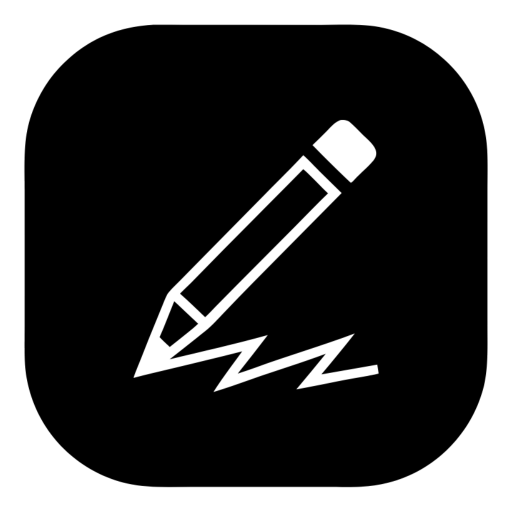

# Doodle Desk

A production-quality, fully offline desktop diagramming application built with **Electron**, **Vite**, **React**, and a native high-performance canvas engine.



---

## 🎨 Features & Capabilities

### 1. Native Diagramming Engine
- **Complete Toolset:** Shapes (Rectangle, Diamond, Ellipse, Arrow, Line, Freehand draw), Text, Eraser, Laser Pointer, Frames, Image Insertion, Web Embeds, Sticky Notes, Precision Ruler, and Flood Fill.
- **Hand-Drawn & Clean Styles:** Sloppiness / roughness controls, stroke styles, fill styles (solid, hachure, cross-hatch), typography, and curated color palettes.
- **Custom Shape Libraries:** Import and export custom shape libraries (`.doodlelib` files).
- **Dark Mode & Theming:** System-synchronized or manual Light / Dark themes.
- **Zen Mode & Grid Styles:** Dot grid, engineering grid, isometric, blueprint, parchment, and standard canvas styles.
- **Command Palette:** Fast keyboard-driven command navigation (`Ctrl+K` / `Cmd+K`).

### 2. File Handling & Lossless Storage
- **Native Document Format:** Open and save `.doodle` JSON documents.
- **Scene-Embedded Exports:** Export to `.png` and `.svg` with embedded diagram metadata, allowing drawings to be reopened and edited losslessly at any time.
- **Shape Libraries:** Save and load reusable component packages (`.doodlelib`).
- **Save Operations:** Save, Save As, and Save a Copy with full path memory.
- **Unsaved Changes Protection:** Native confirmation dialogs on file open, window close, or app quit.
- **Auto-Save & Crash Recovery:** Continuous background snapshots with automatic session restoration if interrupted.
- **Drag & Drop:** Drag diagram files directly from Windows Explorer, macOS Finder, or Linux file managers onto the canvas.

### 3. OS Integration
- **Native Platform Menus:** Customized menus respecting macOS, Windows, and Linux conventions.
- **Keyboard Shortcuts:** Standard platform shortcuts (`Ctrl+N`, `Ctrl+S`, `Ctrl+O`, `Ctrl+P`, zoom, zen mode).
- **Recent Files:** Persistent recent file list in File Menu and Jump Lists.
- **Multi-Window Support:** Open multiple independent documents simultaneously in separate windows.
- **Window State Persistence:** Memorizes window size, position, and maximization state.
- **Export Formats:** PNG (1x, 2x, 3x), SVG, PDF (via Chromium printToPDF), and Clipboard copy.
- **Deep Linking:** Registers `doodle-desk://` protocol for opening drawings via URLs.

### 4. 100% Offline & Secure
- **Zero External Dependencies:** Native rendering and math engine without third-party web CDNs.
- **Context Isolation & Preload Bridge:** `contextIsolation: true`, `nodeIntegration: false`, minimal typed API surface.
- **Strict Content Security Policy (CSP):** No remote code execution. External links are strictly validated and opened in the default browser.

---

## 🛠️ Tech Stack

- **Desktop Framework:** [Electron](https://www.electronjs.org/) (Main process in CommonJS)
- **Frontend Framework:** [React 18](https://react.dev/) + [Vite](https://vitejs.dev/)
- **Canvas Engine:** Native high-performance hand-drawn 2D vector renderer
- **Settings Store:** `electron-store`
- **Auto Updater:** `electron-updater`
- **Testing:** `Vitest` (Unit tests) + `Playwright` (Electron E2E tests)
- **Packaging:** `electron-builder`

---

## 🚀 Getting Started

### Prerequisites
- Node.js 18+ (tested on Node v20/v22)
- npm 9+

### Installation
```bash
git clone <your-repo-url>
cd EX
npm install
```

### Running in Development
```bash
npm run dev
```
Starts the Vite dev server on port `5173` and launches Electron with hot-reload.

---

## 🧪 Testing

### Run Unit Tests
```bash
npm test
```

### Run End-to-End Smoke Tests (Playwright Electron)
```bash
npm run test:e2e
```

---

## 📦 Packaging & Installers

Build native installers for your current platform:

```bash
# Build for current OS
npm run build

# Windows: NSIS Installer (.exe) and Portable build (.exe)
npm run build:win

# macOS: DMG (.dmg) and ZIP (.zip) for x64 / Apple Silicon arm64
npm run build:mac

# Linux: AppImage, Debian (.deb), and RPM (.rpm)
npm run build:linux
```

All installer artifacts will be created in the `release/` directory.

---

## 📜 Copyright & Free Lifetime Usage

Copyright (c) 2026. All rights reserved.

**Doodle Desk** is created and dedicated for **students, teachers, creators, and developers** to use completely free for a lifetime. 

- **100% Free Forever:** No paywalls, no subscriptions, no locked features, and no purchase required.
- **100% Offline & Private:** Your work stays entirely on your local machine with zero external tracking.

Built with ❤️ for learners and developers everywhere.
