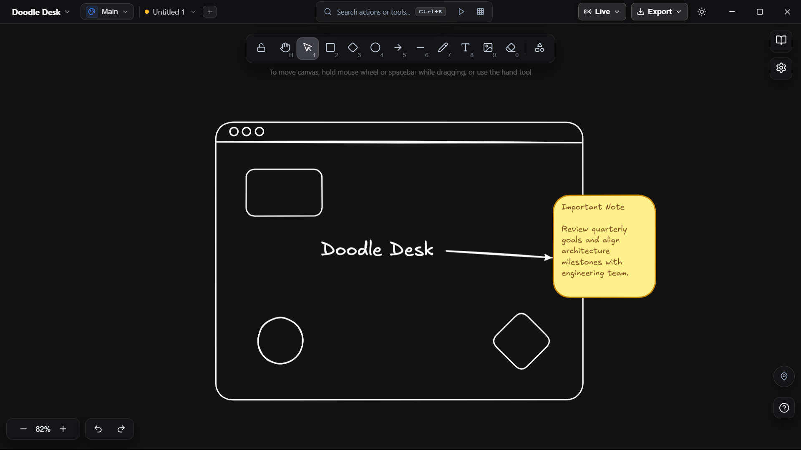

<p align="center">
  <a href="#doodle-desk">
    
  </a>
</p>

<h1 align="center">Doodle Desk</h1>

<p align="center">
  <b>A production-grade, offline desktop whiteboard for sketching hand-drawn diagrams.</b>
  <br />
  Fast, privacy-focused, zero-cloud dependency, and 100% free for a lifetime.
</p>

<p align="center">
  
  
  
  
  
  
</p>

<p align="center">
  
</p>

<p align="center">
  <a href="#-key-features"><b>Features</b></a> •
  <a href="#-tech-stack"><b>Tech Stack</b></a> •
  <a href="#-quick-start"><b>Quick Start</b></a> •
  <a href="#-keyboard-shortcuts"><b>Shortcuts</b></a> •
  <a href="#-packaging--installers"><b>Packaging</b></a> •
  <a href="#-offline--privacy-guarantee"><b>Privacy</b></a>
</p>

---

## 🎨 Key Features

### 🖌️ Native Hand-Drawn Diagramming Engine
- **Versatile Toolset:** Rectangles, diamonds, ellipses, lines, arrows, freehand sketching, text, eraser, laser pointer, and flood fill.
- **Organic Hand-Drawn Aesthetic:** Customize stroke roughness, hachure/cross-hatch fills, stroke widths, hand-drawn typography, and curated color palettes.
- **Canvas Styles & Themes:** Standard whiteboard, blueprint grid, dot grid, isometric grid, engineering dark, and warm parchment styles with smooth light/dark switching.
- **Precision Drawing Tools:** Built-in precision ruler, lasso selection, and shape-recognition auto-detection for quick clean sketches.

### 📁 Multi-Board Workspaces & Lossless Storage
- **Native Document Format:** Lossless `.doodle` JSON documents preserve full vector state, stroke history, and editable layers.
- **Multi-Workspace Hub:** Organize multiple files into distinct boards and switch seamlessly without clutter.
- **Embedded PNG & SVG Exports:** Export `.png` and `.svg` files with embedded diagram metadata, allowing drawings to be reopened and edited losslessly at any time.
- **Shape Component Libraries:** Export and import reusable component packages (`.doodlelib`).
- **Crash Recovery & Auto-Save:** Background snapshot engine ensures zero data loss upon unexpected shutdowns or crashes.

### 🌐 Peer-to-Peer Live Collaboration
- **Zero-Cloud Collaboration:** Share your room ID to draw together in real time over direct WebRTC / PeerJS connections.
- **Collaborator Cursor Tracking:** Follow collaborator viewports and view live cursor positions in color-coded badges.
- **Built-in Session Chat:** Floating peer chat panel with quick message reactions and message history.

### 🖥️ Native Desktop Integration
- **Frameless Studio Design:** Custom dark/light window titlebar with native min, max/restore, and close controls.
- **Native Print Preview:** Built-in print preview with matching studio top bar, landscape/portrait orientation, and OS print dialog integration.
- **Cross-Platform Menus & Deep Linking:** Native application menus, recent files jump list, and `doodle-desk://` protocol support.

---

## ⌨️ Keyboard Shortcuts

| Shortcut | Action |
|---|---|
| `Ctrl+N` / `Cmd+N` | New file in workspace |
| `Ctrl+O` / `Cmd+O` | Open diagram file |
| `Ctrl+S` / `Cmd+S` | Save document |
| `Ctrl+Shift+S` / `Cmd+Shift+S` | Save As... |
| `Ctrl+P` / `Cmd+P` | Print Canvas |
| `Ctrl+K` / `Cmd+K` | Open Command Palette |
| `Ctrl+Z` / `Cmd+Z` | Undo |
| `Ctrl+Y` / `Cmd+Shift+Z` | Redo |
| `Ctrl+C` / `Ctrl+V` | Copy / Paste elements |
| `Ctrl+D` | Duplicate selected elements |
| `Alt+Drag` | Duplicate and drag clone |
| `Alt+Resize` | Resize symmetrically from center |
| `Shift+Draw` | Constrain 1:1 square / circle / straight angle |
| `Shift+Drag` | Constrain element dragging to axis |
| `Ctrl+]` / `Ctrl+[` | Bring to front / Send to back |
| `Ctrl+G` / `Ctrl+Shift+G` | Group / Ungroup selected elements |
| `Ctrl+Shift+>` / `<` | Increase / Decrease text font size |
| `Ctrl++` / `Ctrl+-` | Zoom in / Zoom out |
| `Ctrl+0` / `Cmd+0` | Reset canvas zoom to 100% |
| `Space+Drag` / `Middle Click` | Pan canvas |
| `1` - `0` / `V, R, D, O, A, L, P, T, E, H, F` | Quick tool selection |
| `Alt+F4` / `Cmd+Q` | Quit Doodle Desk |

---

## 🛠️ Tech Stack

| Layer | Technologies |
|---|---|
| **Runtime & Shell** | [Electron 33](https://www.electronjs.org/) (Secure preload IPC bridge, context isolation, native menus) |
| **Frontend Framework** | [React 18](https://react.dev/) + [Vite 6](https://vitejs.dev/) |
| **Canvas Engine** | High-performance 2D vector drawing pipeline with hand-drawn roughness math |
| **Persistence** | [electron-store](https://github.com/sindresorhus/electron-store) (Window state, themes, and user preferences) |
| **Icons & UI** | [Lucide React](https://lucide.dev/) + Vanilla CSS token design system |
| **Testing** | [Vitest](https://vitest.dev/) (Unit/Integration) + [Playwright](https://playwright.dev/) (Electron E2E) |
| **Distribution** | [electron-builder](https://www.electron.build/) (Cross-platform installer packaging) |

---

## 🚀 Quick Start

### Prerequisites
- **Node.js 18+** (Node 20 or 22 LTS recommended)
- **npm 9+**

### Installation

```bash
# Clone the repository
git clone https://github.com/yvvsatyanarayana-dev/Doodle-Desk.git

# Navigate to project directory
cd Doodle-Desk

# Install dependencies
npm install
```

### Running in Development

```bash
# Launches Vite dev server + Electron with hot-reloading
npm run dev
```

---

## 🧪 Testing

```bash
# Run unit & integration test suite (Vitest)
npm test

# Run end-to-end Electron desktop smoke tests (Playwright)
npm run test:e2e
```

---

## 📦 Packaging & Installers

Generate production-ready standalone installers into the `release/` directory:

```bash
# Package for your current operating system
npm run build

# Windows: NSIS Installer (.exe) + Portable executable (.exe)
npm run build:win

# macOS: Apple Disk Image (.dmg) + Universal Zip (.zip)
npm run build:mac

# Linux: AppImage, Debian (.deb), and RPM (.rpm)
npm run build:linux
```

---

## 🔒 Offline & Privacy Guarantee

- **100% Offline by Default:** Zero tracking, telemetry, or remote server pings.
- **Strict Content Security Policy (CSP):** No remote script execution or external CDN downloads.
- **Context Isolation:** Web content runs completely isolated with strict preload IPC communication channels.

---

## 📜 License & Free Lifetime Commitment

Copyright (c) 2026. All rights reserved.

**Doodle Desk** is built and maintained as a **100% free lifetime resource for students, teachers, creators, and developers worldwide**. No subscriptions, no paywalls, and no hidden fees — forever.
